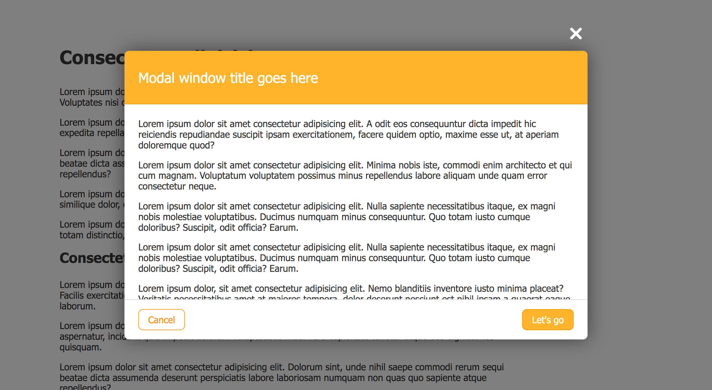
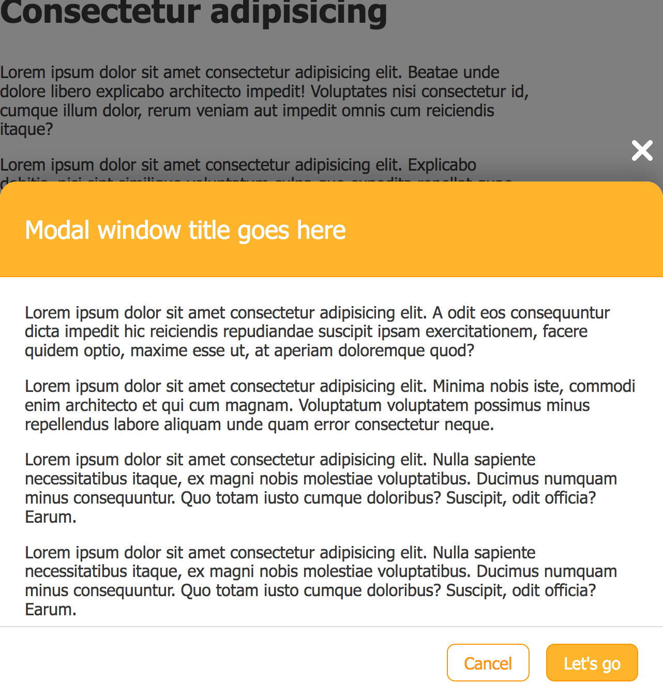
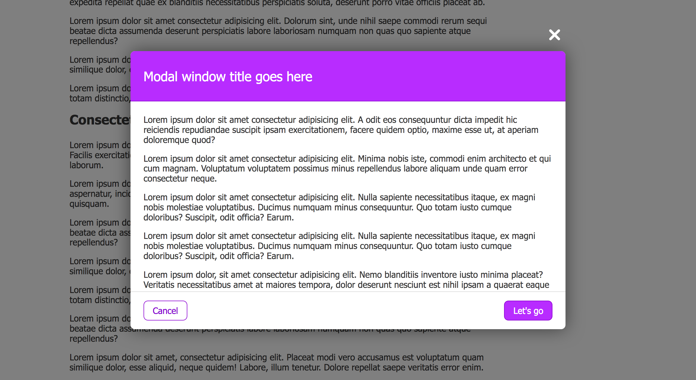
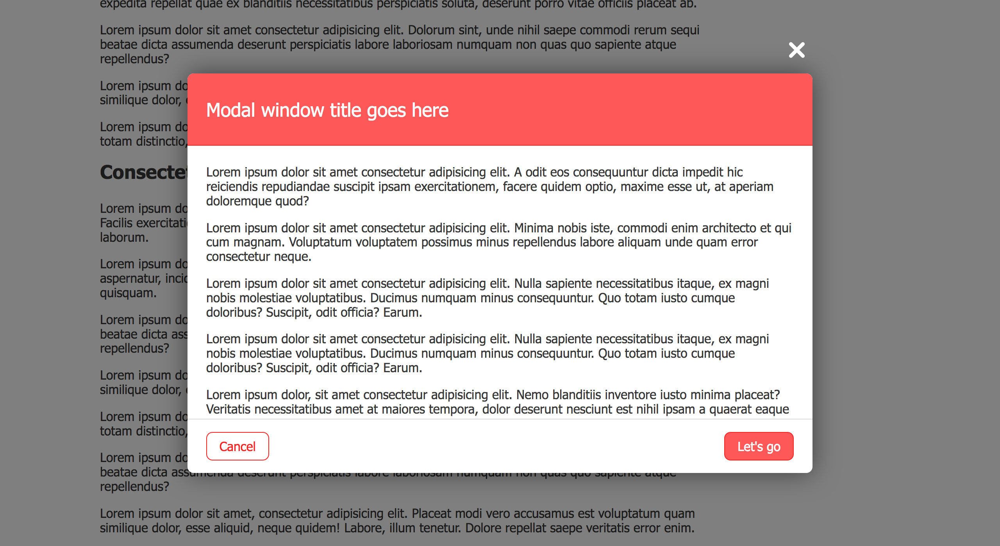
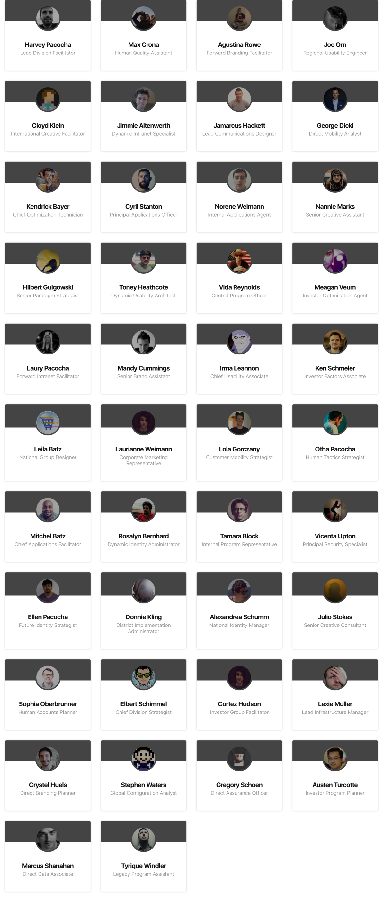
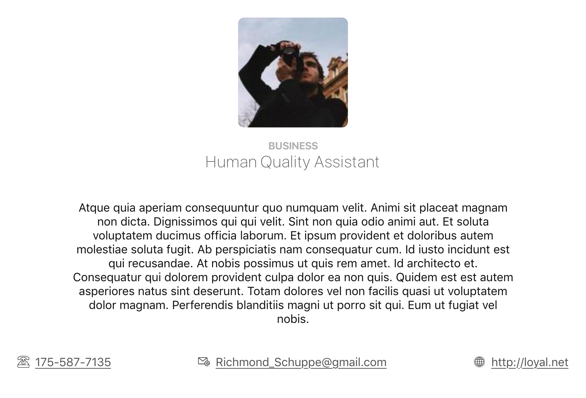
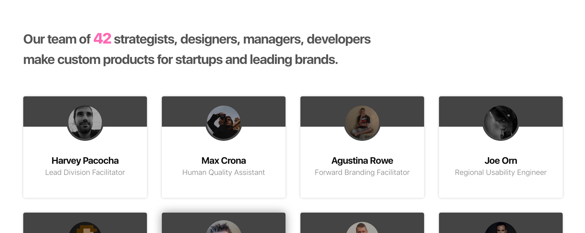
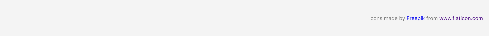
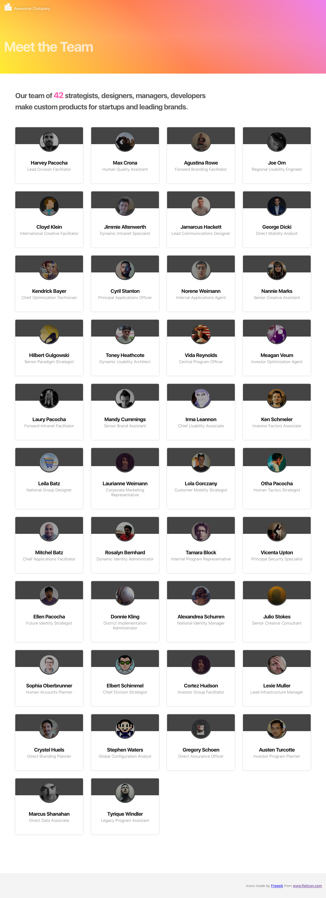

# Interactive Modal

Remeber the modal we did in UI Basics? Let's bring it to life with React.

## Modal component

Let's start by creating a `Modal` component.
Feel free to reuse the markup and CSS from the UI Basics exercise, or start from scratch - your choice!

This is how the `Modal` should look like on desktop:

and on mobile:

### Requirements

Modal title should be customizable, meaning you can pass text to display as modal title.

Modal content should be any HTML. You can achieve this with `props.children`, take a look at the [docs](https://reactjs.org/docs/glossary.html#propschildren).

The `Modal` component should be themeable with the following themes:

* `sunshine` - look at the example above
* `deep-purple` -

* `roasted-peppers` -

* default -> black colors

There should also be reasonable defaults for the button labels. It should be possible to add also custom labels for:

* left button
* right button

The `Modal` component should allow a custom action to be performed on modal close. Props can have different values - string, number, array, object... but also functions. We can then call the function passed via the prop from the child component.

## List employees

`employee.json` contains a list of employees. Let's display all of them:

Each emplyoee card should display:

* name
* image
* job description of the employee

## Employee details

Let's show more details about the employee. On click on an employee card, a modal should open displaying additional details.

The title of the modal should be full name of the emplyoee.

In the content area of the modal should be displayed:

* image
* department
* job description
* bio
* contacts list

The modal theme is determined by the department the employee is in:

* business - `sunshine`
* engineering - `deep-purple`
* design - `roasted-peppers`

## Next / Previous employee

Let's add some functionality to the buttons.
The right one should say: `Next`, the left one should display: `Previous`.

Modify the `Modal` component to allow to pass custom functions for:

* left button click
* right button click

On click on next - show next emplyoee in list.
On click on previous - show previous employee in list.

## Intro text 

To make the page look more complete, let's add some intro text right above the list of employees:

Text for intro: Our team of 23 strategists, designers, managers, developers make custom products for startups and leading brands.

In the above sentence `23` should be the actual number of employees.

## Add site header and site footer

To complete the site, let's add site header and footer.
If you decide to create components for header and footer, beware - `header` and `footer` cannot be the names of your components, they already exist as HTML elements.

Site header looks like this:

Site footer:

No need for customization in these two components.

Here are the texts if you want to use the same:

* text for the header: Meet the Team
* text for footer: Icons made by <a href="https://www.flaticon.com/authors/freepik" title="Freepik">Freepik</a> from <a href="https://www.flaticon.com/" title="Flaticon"> www.flaticon.com</a>

## Final result

This is how the site should look at the end:

